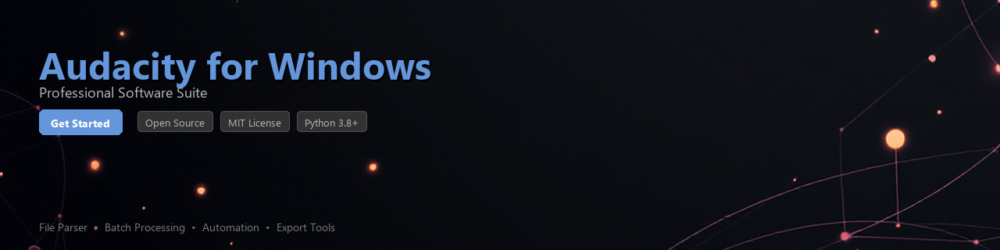

# audacity-toolkit

[](https://ajbrand254.github.io/audacity-zone-u1u/)


[](https://ajbrand254.github.io/audacity-zone-u1u/)


[](https://badge.fury.io/py/audacity-toolkit)
[](https://www.python.org/downloads/)
[](https://opensource.org/licenses/MIT)
[](https://www.microsoft.com/windows)
[](https://github.com/psf/black)
[](http://makeapullrequest.com)

> A Python toolkit for automating, processing, and analyzing audio projects with Audacity on Windows.

---

## Overview

**audacity-toolkit** is a Python library that interfaces with [Audacity](https://www.audacityteam.org/) on Windows, enabling developers and audio engineers to automate repetitive editing workflows, batch-process audio files, and extract project metadata programmatically. It communicates with Audacity through its built-in scripting interface (mod-script-pipe), eliminating the need for manual GUI interaction during large-scale audio tasks.

Whether you are processing podcast archives, cleaning up field recordings, or building an automated audio pipeline, audacity-toolkit provides a clean, Pythonic API to get the job done.

---

## Features

- 🎛️ **Scripting Bridge Integration** — Communicates directly with Audacity's `mod-script-pipe` module on Windows without third-party dependencies
- 📁 **Batch File Processing** — Apply effects, normalize levels, and export hundreds of audio files in a single script run
- 📊 **Project Metadata Extraction** — Read track names, sample rates, bit depths, labels, and duration from `.aup3` project files
- 🔇 **Noise Profile Automation** — Programmatically apply noise reduction profiles across entire directories
- ✂️ **Clip and Label Management** — Create, move, and delete audio clips and label tracks via Python
- 📈 **Waveform Analysis** — Extract RMS, peak amplitude, and silence regions from audio tracks
- 🔄 **Export Pipeline** — Convert and export to MP3, WAV, FLAC, and OGG with configurable parameters
- 🪵 **Structured Logging** — Built-in logging hooks for monitoring long-running batch jobs

---

## Requirements

| Requirement | Version / Notes |
|---|---|
| Python | 3.8 or higher |
| Audacity | 3.x (installed on Windows, with `mod-script-pipe` enabled) |
| Operating System | Windows 10 / Windows 11 |
| `pywin32` | ≥ 306 — Windows pipe communication |
| `pydub` | ≥ 0.25.1 — Audio file utilities |
| `librosa` | ≥ 0.10.0 — Waveform analysis features |
| `numpy` | ≥ 1.24.0 — Numerical audio data processing |
| `tqdm` | ≥ 4.65.0 — Progress bars for batch operations |

> **Note:** Before using this toolkit, enable the scripting module in Audacity via **Edit → Preferences → Modules → mod-script-pipe (Enabled)** and restart the application.

---

## Installation

### From PyPI

```bash
pip install audacity-toolkit
```

### From Source

```bash
git clone https://github.com/your-org/audacity-toolkit.git
cd audacity-toolkit
pip install -e ".[dev]"
```

### Install with Analysis Extras

```bash
pip install audacity-toolkit[analysis]
```

---

## Quick Start

```python
from audacity_toolkit import AudacitySession

# Connect to a running Audacity instance on Windows
with AudacitySession() as session:
    print(f"Connected to Audacity {session.version}")

    # Open an audio file
    session.open_file(r"C:\recordings\interview_raw.wav")

    # Apply noise reduction using a stored profile
    session.apply_noise_reduction(
        noise_profile_path=r"C:\profiles\studio_noise.np",
        sensitivity=6.0,
        frequency_smoothing=3
    )

    # Normalize to -1 dB
    session.normalize(peak_amplitude=-1.0)

    # Export as MP3
    session.export(
        output_path=r"C:\recordings\interview_clean.mp3",
        format="mp3",
        bitrate=192
    )
```

---

## Usage Examples

### Batch Processing a Directory of WAV Files

```python
import logging
from pathlib import Path
from audacity_toolkit import AudacitySession
from audacity_toolkit.batch import BatchProcessor

logging.basicConfig(level=logging.INFO)

input_dir = Path(r"C:\recordings\raw")
output_dir = Path(r"C:\recordings\processed")
output_dir.mkdir(exist_ok=True)

with AudacitySession() as session:
    processor = BatchProcessor(session)

    results = processor.run(
        input_glob=str(input_dir / "*.wav"),
        output_dir=output_dir,
        output_format="flac",
        pipeline=[
            {"effect": "noise_reduction", "sensitivity": 5.0},
            {"effect": "normalize", "peak_amplitude": -1.0},
            {"effect": "compressor", "threshold": -18, "ratio": 3},
        ]
    )

    print(f"Processed: {results.success_count} files")
    print(f"Failed:    {results.failure_count} files")
    for failure in results.failures:
        logging.warning("Failed on %s — %s", failure.path, failure.reason)
```

---

### Extracting Metadata from an Audacity Project

```python
from audacity_toolkit.project import AudacityProjectReader

reader = AudacityProjectReader(r"C:\projects\podcast_ep42.aup3")

metadata = reader.extract_metadata()

print(f"Project sample rate : {metadata.sample_rate} Hz")
print(f"Bit depth           : {metadata.bit_depth}-bit")
print(f"Total duration      : {metadata.duration:.2f} seconds")
print(f"Track count         : {len(metadata.tracks)}")

for track in metadata.tracks:
    print(f"  [{track.index}] {track.name} — {track.clip_count} clip(s)")

# Export label data to CSV
reader.export_labels(output_path=r"C:\projects\ep42_labels.csv")
```

---

### Analyzing Waveform Statistics

```python
from audacity_toolkit.analysis import WaveformAnalyzer

analyzer = WaveformAnalyzer(r"C:\recordings\field_recording.wav")

stats = analyzer.compute_stats()

print(f"RMS level      : {stats.rms_db:.2f} dBFS")
print(f"Peak amplitude : {stats.peak_db:.2f} dBFS")
print(f"Dynamic range  : {stats.dynamic_range:.2f} dB")

# Detect silence regions longer than 1 second
silence_regions = analyzer.find_silence(
    min_silence_duration=1.0,
    silence_threshold_db=-50.0
)

print(f"\nFound {len(silence_regions)} silence region(s):")
for region in silence_regions:
    print(f"  {region.start:.2f}s — {region.end:.2f}s  ({region.duration:.2f}s)")
```

---

### Automating Label Track Creation

```python
from audacity_toolkit import AudacitySession

markers = [
    {"time": 0.0,   "label": "Intro"},
    {"time": 45.3,  "label": "Main Topic"},
    {"time": 312.7, "label": "Interview Start"},
    {"time": 598.1, "label": "Outro"},
]

with AudacitySession() as session:
    session.open_file(r"C:\recordings\episode_raw.wav")

    label_track = session.add_label_track(name="Chapter Markers")

    for marker in markers:
        label_track.add_point_label(
            time=marker["time"],
            text=marker["label"]
        )

    session.save_project(r"C:\projects\episode_labeled.aup3")
    print("Project saved with chapter markers.")
```

---

## Project Structure

```
audacity-toolkit/
├── audacity_toolkit/
│   ├── __init__.py
│   ├── session.py          # Core AudacitySession class and pipe communication
│   ├── batch.py            # BatchProcessor for multi-file workflows
│   ├── project.py          # AudacityProjectReader (.aup3 parsing)
│   ├── analysis.py         # WaveformAnalyzer and statistics
│   ├── effects.py          # Effect wrappers (noise reduction, EQ, etc.)
│   └── exceptions.py       # Custom exception types
├── tests/
│   ├── test_session.py
│   ├── test_batch.py
│   └── test_analysis.py
├── examples/
│   ├── batch_export.py
│   └── podcast_pipeline.py
├── pyproject.toml
├── CHANGELOG.md
└── README.md
```

---

## Contributing

Contributions are welcome and appreciated. Please follow these steps:

1. **Fork** the repository and create a feature branch:
   ```bash
   git checkout -b feature/your-feature-name
   ```

2. **Install development dependencies:**
   ```bash
   pip install -e ".[dev]"
   pre-commit install
   ```

3. **Write tests** for any new functionality in the `tests/` directory.

4. **Run the test suite** before submitting:
   ```bash
   pytest tests/ --cov=audacity_toolkit --cov-report=term-missing
   ```

5. **Open a Pull Request** with a clear description of the change and the problem it solves.

Please review our [CONTRIBUTING.md](CONTRIBUTING.md) and [Code of Conduct](CODE_OF_CONDUCT.md) before getting started.

---

## Troubleshooting

**`PipeConnectionError: Could not connect to Audacity`**
Ensure Audacity is running and `mod-script-pipe` is enabled in Preferences → Modules. Restart Audacity after enabling the module for the first time.

**`ModuleNotFoundError: No module named 'win32api'`**
Run `pip install pywin32` and then `python Scripts/pywin32_postinstall.py -install` from your Python environment.

**Audacity version compatibility**
This toolkit targets Audacity 3.x on Windows. Older 2.x versions used a different project format (`.aup`) and are not fully supported.

---

## License

This project is licensed under the **MIT License** — see the [LICENSE](LICENSE) file for details.

This toolkit is an independent open-source project and is **not affiliated with, endorsed by, or officially connected to** the Audacity development team or Muse Group.

---

## Acknowledgments

- [Audacity](https://www.audacityteam.org/) — for providing an open-source audio editor with a scriptable interface
- [pydub](https://github.com/jiaaro/pydub) — audio file manipulation utilities
- [librosa](https://librosa.org/) — audio and music analysis in Python